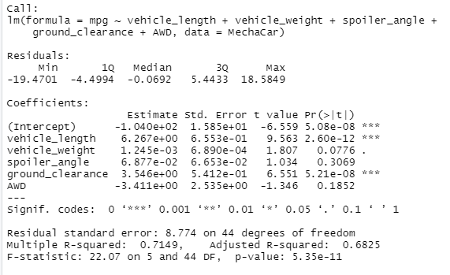

# MechaCar Statistical Analysis

# Overview
AutosRUs' newest prototype, the MechaCar, is suffering from producation troubles that are blocking the manufacturing team's progress. AutosRUs' have tasked the data analytics team to review the producation data for insights that may help the manufacturing team. 

# Results
## Linear Regression to Predict MPG
* Vehicle_weight, spoiler_angle and AWD providenon-random amount of variance. The maximum random variance was provided by ground_clearence and vehicle_length.

* p-value is less than zero (5.35e-11), the slope is not equal to zero

* The R squared value is 71.49% of the time the predication will be correct using the linear model. This model has a strong correlation and may be used effectivly to predict the mpg of the MechaCar. 

## Summary Statistics on Suspension Coils
When analysing the Total Summary data we see that it is under the 100 psi and meets the specifications, however when further analysing the individual Lot Summaries, there is a significant variance in Lot 3 that is hight than the acceptable specifications. 

## T-Tests on Suspension Coils
* An analysis of the results of the T-test for the suspension coils across all manufacturing lots shows that they are not statistically different from the population mean, and the p-value is not low enough (0.0603) for us to reject the null hypothesis.

Lot 1
* An anaylsis of the results of the T-test for the suspension coils for Lot 1 shows that they are not statistically different from the population mean, and the p-value is not low enough (1) for us to reject the null hypothesis.

Lot 2
* An anylisis of the results of the T-test for the suspension coils for Lot 2 shows that they are not statistically different from the population mean, and the p-value is not low enough (0.6072) for us to reject the null hypothesis.

Lot 3 
* An analysis of the results of the T-test for the suspension coils for Lot 3 shows that they are slightly statistically different from the population mean, and the p-value is low enough (0.0417) for us to reject the null hypothesis. This lot needs further analysis or removal from the data set and seperated to understand the reasons for the statisitcal differences. 

## Summary
Analyzing all the data we dee that the major impacts on MPG are care weight, AWD, and spoiler angle. To improve the MPG of the MechaCar design modifications should be made on these variables. 

Lot 3 on the suspension coils should be seperated for further analysis.

# Study Design: MechaCar vs. Competition
Families today are looking for safe, reliable and cost efficent vehicals. Additional analysis to determine how the MechaCar compares to it's competators could analysis these variables. 
### Metric to Test
* Safety Rating, Fuel Efficiency, Maintenance Costs, Price per Vehical
### Null and Alternate Hypothesis
* Null Hypothesis = The price per vehical, maintenance costs and fuel efficiencey of the MechaCar is similar to the price per vehical of the competators.
* Alternative Hypothesis = The price per vehical maintenance costs, fuel efficiency of the MechaCar is significantly higher than the competators. 

### Statistical Test Used
* Using an ANOVA would show wheather the differences between the safety rating, fuel efficiency, maintenance costs of the MechaCar and it's competators was statistically significant. 

### Additional Data Needed
* Safety Ratings, Maintenance Cost, Fuel Efficiency and Price per vehical